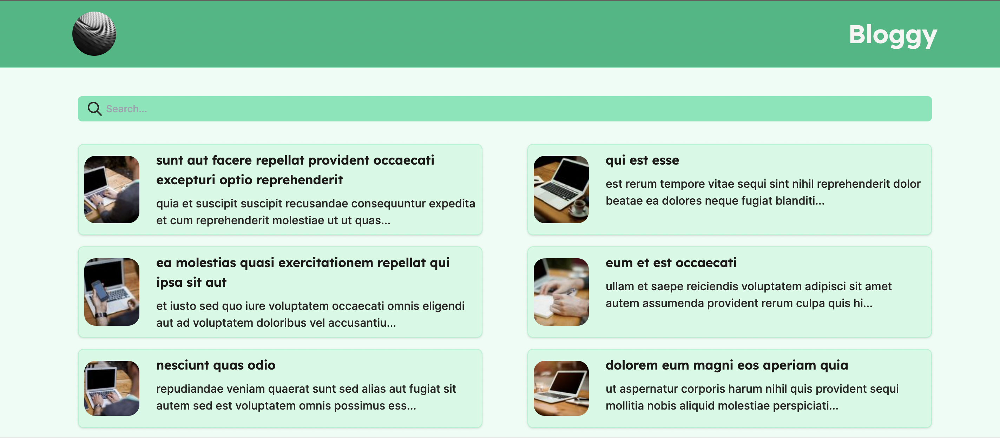
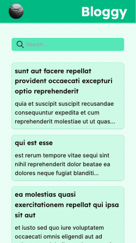

# My Portfolio and Blog:

## Content

1. [Status](#Status)
2. [Motivation](#Motivation) 
3. [Requirements](#Requirements)
4. [Pages](#Pages)
    - [Home](#Home)

## Status

## Motivation

This repository holds a blog with a filtering functionality.

[`https://blogo-opal.vercel.app/`](https://blogo-opal.vercel.app/).

In this project, I created a simple next.js app that consumes some filler data and displays it such that you can filter your prefered posts.

You can run it by cloning the repository. Running `cd blogo`, `yarn` then executing the command `yarn dev`.

You will be able to access the server on localhost:3000 by default.

## Requirements

Typescript, Tailwind Css, Next.js and more.

## Pages
### *Home*

##### /

###### Introduction

Landing page listing blog posts with filtering function

